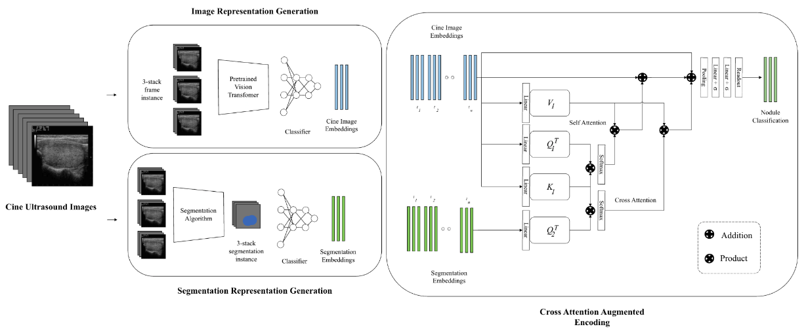

# Thyroid Cross Attention

Implementation of "Segmentation-Augmented Time Series Representation Learning with Cine Thyroid Medical Images"

**Dataset** 

Dataset used for testing overall model for time series classification of the cine dataset is the Stanford Cine dataset originally introduced in [(Yamashita et al. 2022, *Radiol Artif Intell.*)](https://pmc.ncbi.nlm.nih.gov/articles/PMC9152684/)

- Thyroid Nodules: 192
- Sequence Length: Variable per patient
- Class 0: 175
- Class 1: 17
- Number of Classes: 2

The dataset was seperated into 5 folds, each preserving class distribution (stratified). To ensure that the frame length is preserved for the folds, arrangments of folds were done by seperating patients into their respective classes, and ordering the patients in each class group from most frames to least frames. The patients with the highest number of frames in their class group were then grouped with the patients with the lower number of frames, and second highest with the second lowest and so on, similar to a double ended queue. 

Dataset is stored in h5ad containing the raw thyroid cine frames and their respective annotated mask of the ROI of the thyroid. Patient-wise labels were then translated to image-wise labels, and respective folds are assigned.

#

### Install Env:

    conda create -n MMCA_simul python=3.11

    bash INSTALL_ENV.sh

Dependencies: 
- python = 3.11
- cuda 11.8
- torch 2.2.1
- torchvision = 0.17.1
- torchaudio = 2.2.1
- torch sparse

#

### Model Architecture:

#

### Run

Model weights are saved in their respective folders. To evaluate model using each module, run the following:

    ##EXAMPLE CODE
        
    #evaluate msunet + classifier on fold 0
    python3 main.py --MSUNET --FOLD 0

    #evaluate vision_transformer + classifier on fold 0
    python3 main.py --VIT --FOLD 0

    #(FULL BACKBONE) evaluate vision_transformer + msunet + classifier on fold 0
    python3 main.py --JOINTFUSION --FOLD 0

    #evaluate msunet + mmca
    python3 main.py --MSUNET --MMCA --FOLD 0

    #evaluate vision_transformer + mmca on fold 0
    python3 main.py --VIT --MMCA --FOLD 0

    #(FULL MODEL) evaluate vision_transformer + msunet + mmca on fold 0
    python3 main.py --JOINTFUSION --MMCA --FOLD 0

